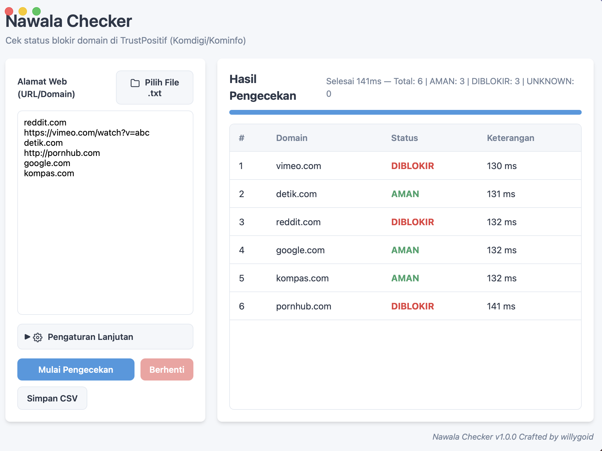

# Nawala Checker


Cek status blokir domain di TrustPositif (Komdigi/Kominfo) untuk mengetahui apakah suatu situs terkena nawala atau tidak. Terdiri dari satu file eksekusi dengan dua mode: CLI dan GUI (Berbasis Web UI). Mendukung kompilasi lintas platform (macOS, Windows, Linux untuk CLI), menggunakan worker pool, dengan hasil realtime tanpa perlu menunggu semua proses selesai. Aplikasi yang siap pakai dapat didownload di folder Builds (Windows/MacOs).

## Fitur

- CLI dan GUI dalam satu aplikasi (GUI dikembangkan menggunakan Wails v2 dengan teknologi web HTML/CSS/JS).
- Cepat dan asinkron, jumlah worker bisa diatur menggunakan argumen `-w`.
- Menampilkan hasil secara realtime satu per satu.
- Mendukung input dari banyak file teks sekaligus (`-f a.txt -f b.txt`), argumen manual, maupun pipe dari terminal.
- Otomatis membersihkan URL yang berantakan (misal: `https://situs.com/path`, `situs.com:8080`, `sub.situs.com` semuanya akan dinormalisasi menjadi hanya hostname).
- Menghapus duplikat secara otomatis dari semua sumber input.
- Menyimpan hasil akhir ke dalam format CSV (`-o`) dan JSON (`-json`).
- Memiliki fitur coba ulang (retry) otomatis jika server gagal merespons, serta melakukan pergantian alamat API ke kominfo.go.id jika komdigi.go.id bermasalah.
- Pemindaian bisa dihentikan kapan saja (Ctrl+C di CLI, tombol Stop di GUI) tanpa menghilangkan hasil yang sudah dipindai.

## Build

```sh
go build -o nawala-checker .
```

Catatan tambahan:
Untuk GUI lintas sistem operasi, proyek ini sekarang menggunakan Wails v2. Pastikan Wails sudah terinstal.
Membangun aplikasi versi Mac dan Windows bisa dilakukan dengan menjalankan perintah:
```sh
./build.sh
```
Catatan untuk pengguna Mac: Build GUI untuk sistem operasi Linux tidak disertakan secara bawaan pada skrip karena Wails mensyaratkan dependensi WebKit2GTK yang membutuhkan lingkungan Linux asli.

## Pemakaian

### GUI

```sh
./nawala-checker          # dijalankan tanpa argumen akan membuka mode GUI
./nawala-checker gui      # pemanggilan mode eksplisit
```

Di GUI: Anda dapat mengetik domain secara manual (satu domain per baris) di area teks yang tersedia, atau memuat file teks (.txt) melalui tombol Pilih File. Klik tombol Mulai Pengecekan, dan hasil akan muncul secara langsung di tabel dengan indikator warna. Anda juga bisa menyimpan hasil ke CSV.

### CLI

```sh
# dari file (boleh banyak) ditambah argumen langsung
./nawala-checker -f domains.txt -f lainnya.txt reddit.com -w 20

# menggunakan sistem pipe
cat domains.txt | ./nawala-checker

# hanya menampilkan domain yang terblokir dan menyimpannya ke CSV
./nawala-checker -f domains.txt -q -o hasil.csv
```

| Flag | Default | Keterangan |
|---|---|---|
| `-f file.txt` | kosong | file input, boleh dimasukkan berkali-kali |
| `-w` | 10 | jumlah worker concurrent |
| `-t` | 15s | batas waktu maksimal per request |
| `-r` | 3 | jumlah maksimal coba ulang per domain |
| `-o file.csv` | kosong | simpan hasil ke CSV |
| `-json file.json` | kosong | simpan hasil ke JSON |
| `-q` | mati | hanya tampilkan yang berstatus DIBLOKIR |
| `-no-color` | mati | hilangkan warna dari output terminal |

Exit code: `0` sukses, `3` ada hasil UNKNOWN (pencarian gagal), `1` atau `2` terdapat error sistem.

### Format file input

Satu URL atau domain per baris. Baris kosong dan komentar (diawali tanda `#`) akan diabaikan. Schema (http/https), path, port, dan kredensial akan otomatis dibuang:

```
reddit.com
https://vimeo.com/watch?v=abc
http://situs.com:8080/path
# baris ini adalah komentar dan akan dilewati
```

## Status Pengecekan

| Status | Penjelasan |
|---|---|
| DIBLOKIR | Domain terdaftar di database TrustPositif. |
| AMAN | Domain bebas dan tidak terdaftar. |
| UNKNOWN | Pengecekan gagal dilakukan setelah menghabiskan kesempatan retry. |
